# Kubernetes Custom Image & RBAC Lab


A hands-on Kubernetes lab that covers the full path from building a custom Ubuntu-based Docker image (with `curl` and `kubectl` baked in), publishing it to Docker Hub, running it as a Pod, and validating **Role-Based Access Control (RBAC)** from inside the running container using a dedicated `ServiceAccount`, `Role`, and `RoleBinding`.

---

## Table of Contents

- [Overview](#overview)
- [Architecture](#architecture)
- [Repository Structure](#repository-structure)
- [Prerequisites](#prerequisites)
- [Step 1 — Build the Custom Image](#step-1--build-the-custom-image)
- [Step 2 — Push to Docker Hub](#step-2--push-to-docker-hub)
- [Step 3 — Create the ServiceAccount](#step-3--create-the-serviceaccount)
- [Step 4 — Deploy the Pod](#step-4--deploy-the-pod)
- [Step 5 — Configure RBAC](#step-5--configure-rbac)
- [Step 6 — Test Permissions Inside the Pod](#step-6--test-permissions-inside-the-pod)
- [Results Summary](#results-summary)
- [Cleanup](#cleanup)
- [Key Takeaways](#key-takeaways)

---

## Overview

| Area | What was done |
|------|---------------|
| **Docker image** | Built a lightweight image on `ubuntu:latest` with `curl`, `ca-certificates`, and the latest stable `kubectl`. |
| **Container behavior** | Uses `sleep` as the entrypoint so the container stays alive and can be used as an in-cluster toolbox. |
| **Registry** | Pushed to Docker Hub as `heshamelshereef26/ubuntu-custom:v2.0.0`. |
| **Identity** | Created a dedicated ServiceAccount (`sa`) and attached it to the Pod. |
| **Authorization** | Defined a `Role` (`pod-reader`) for Pods, Secrets, and Deployments, bound to `sa` with a `RoleBinding` (`read-pods`). |
| **Validation** | Ran `kubectl` from inside the Pod to confirm allowed actions succeed and unauthorized actions return `Forbidden`. |

---

## Architecture

```text
   Dockerfile
       │
       ▼
 Ubuntu Custom Image
 (curl + kubectl + sleep)
       │
       ▼
   Docker Hub
       │
       ▼
 Kubernetes Pod ──────────► ServiceAccount (sa)
                                   │
                                   ▼
                              Role (pod-reader)
                                   │
                                   ▼
                          RoleBinding (read-pods)
                                   │
                                   ▼
                           RBAC Permissions
```

---

## Repository Structure

```text
.
├── Dockerfile                 # Custom Ubuntu image with curl + kubectl
├── sa.yaml                    # ServiceAccount manifest
├── role_RBinding.yml          # Role rules + RoleBinding
├── pod-ubuntu-customize.yml   # Pod running the custom image with the ServiceAccount
├── images/                    # Lab screenshots
└── README.md
```

| File | Purpose |
|------|---------|
| `Dockerfile` | Instructions for building the Ubuntu + `kubectl` image. |
| `sa.yaml` | Creates the `sa` ServiceAccount in the `default` namespace. |
| `role_RBinding.yml` | Contains the `Role` rules and the `RoleBinding` that grants them to `sa`. |
| `pod-ubuntu-customize.yml` | Deploys the custom image as a Pod using the `sa` ServiceAccount. |

---

## Prerequisites

- [Docker](https://docs.docker.com/get-docker/)
- A running Kubernetes cluster (Minikube was used in this lab)
- [kubectl](https://kubernetes.io/docs/tasks/tools/)
- A Docker Hub account (only needed to push your own image)

---

## Step 1 — Build the Custom Image

The `Dockerfile` starts from `ubuntu:latest`, installs `curl` and `ca-certificates`, downloads the latest stable `kubectl`, and uses `sleep 10000` to keep the container running.

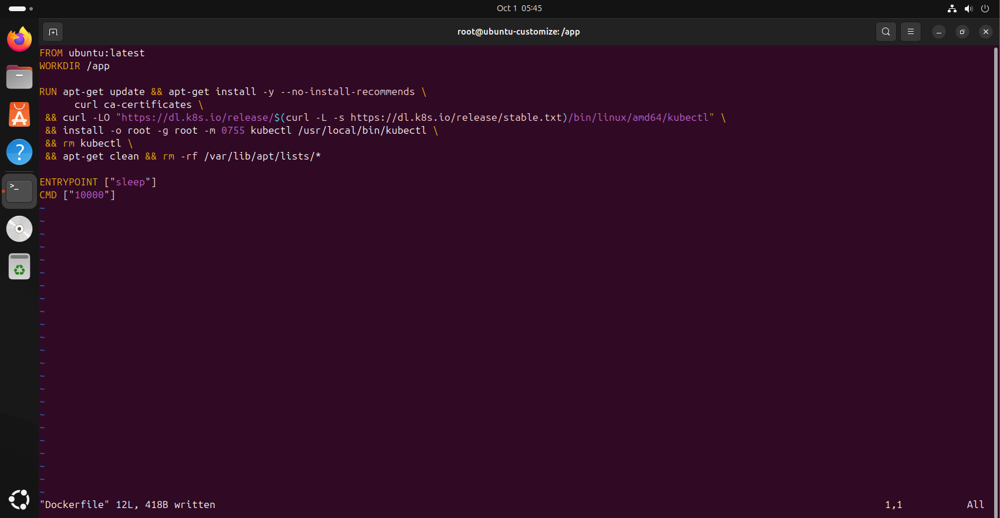

```bash
docker build -t ubuntu-custom .
docker image ls
```

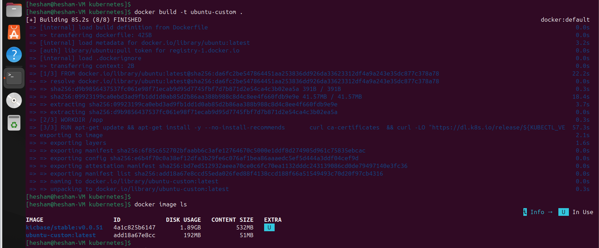

---

## Step 2 — Push to Docker Hub

Tag the image and push it to Docker Hub:

```bash
docker login
docker tag ubuntu-custom:latest heshamelshereef26/ubuntu-custom:v2.0.0
docker push heshamelshereef26/ubuntu-custom:v2.0.0
```

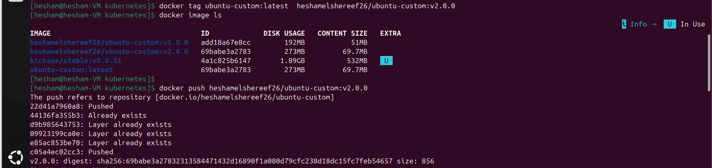

The image is now available on Docker Hub:

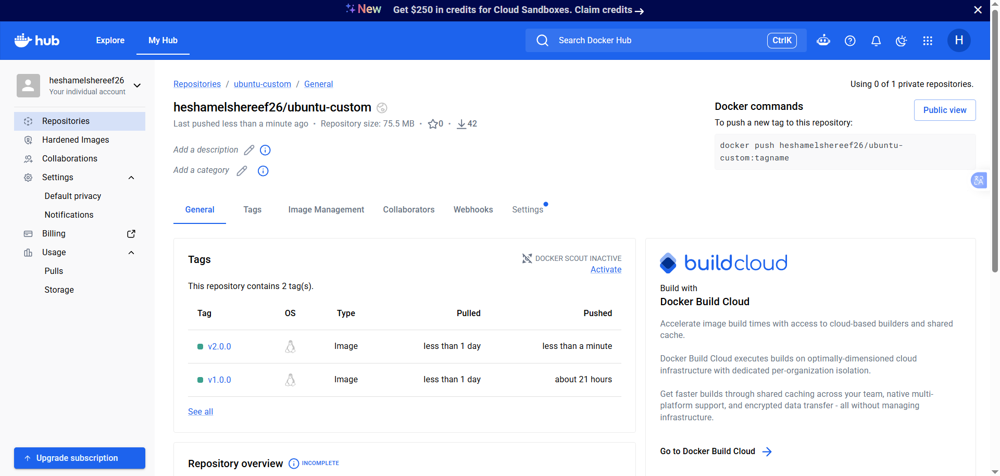

---

## Step 3 — Create the ServiceAccount

```bash
kubectl apply -f sa.yaml
kubectl get sa
```

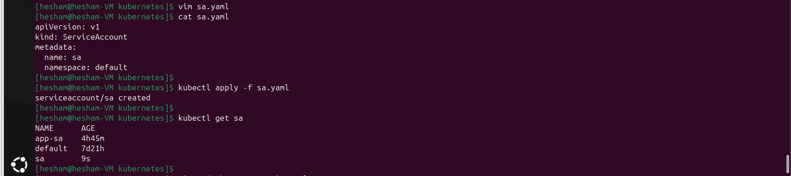

---

## Step 4 — Deploy the Pod

The Pod runs the custom image and uses the `sa` ServiceAccount through `serviceAccountName`.

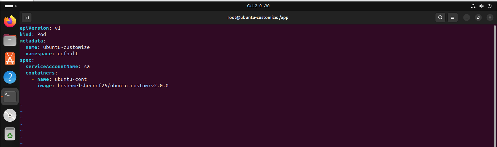

```bash
kubectl apply -f pod-ubuntu-customize.yml
kubectl get po
```

---

## Step 5 — Configure RBAC

`role_RBinding.yml` defines the `pod-reader` Role and the `read-pods` RoleBinding that attaches it to the `sa` ServiceAccount.

| Resource | API group | Allowed verbs |
|----------|-----------|---------------|
| `pods` | core (`""`) | `get`, `watch`, `list`, `create` |
| `secrets` | core (`""`) | `get`, `watch`, `list`, `create`, `delete` |
| `deployments` | `apps` | `get`, `watch`, `list`, `create`, `update` |

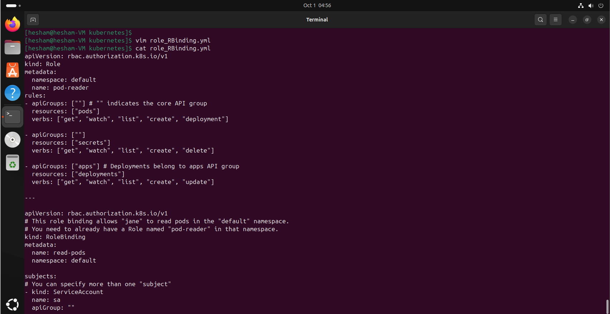

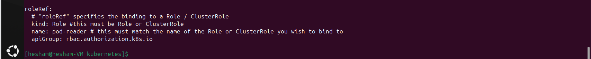

```bash
kubectl apply -f role_RBinding.yml
kubectl get role
kubectl get rolebinding
```

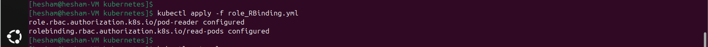

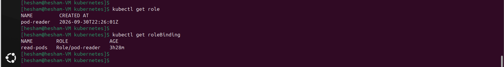

---

## Step 6 — Test Permissions Inside the Pod

Open a shell inside the running Pod:

```bash
kubectl exec -it ubuntu-customize -- bash
```

### Pods

Creating a Pod works, but deleting it is rejected because `delete` is not granted on `pods`.

```bash
kubectl run hhh1 --image nginx
kubectl delete po hhh1
```

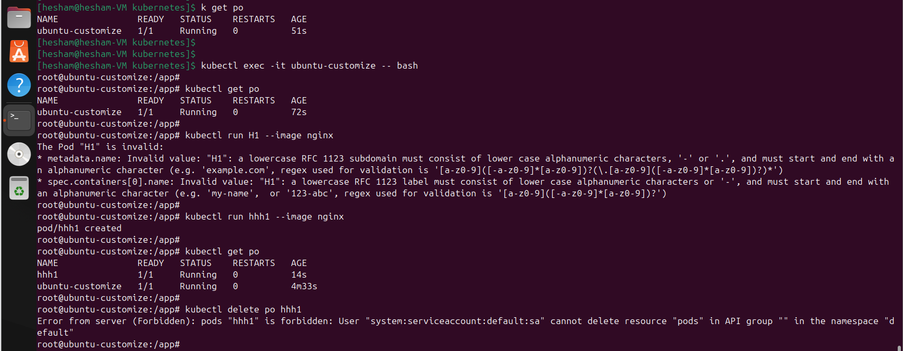

### Deployments

Creating a Deployment works, but deleting it is rejected because `delete` is not granted on `deployments`.

```bash
kubectl create deployment my-web --image=nginx
kubectl delete deploy my-web
```

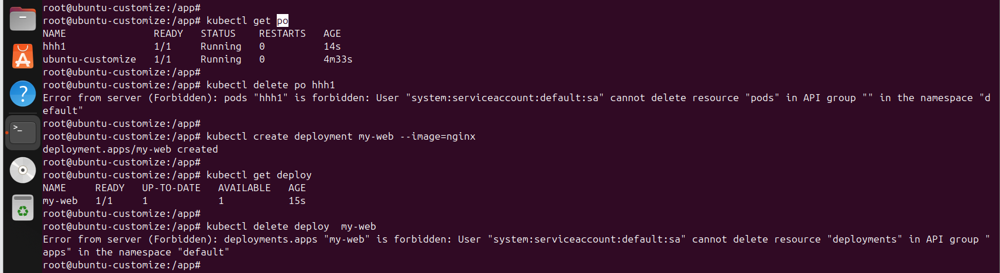

### Secrets

Both creating and deleting a Secret work, because the Role grants `create` and `delete` on `secrets`.

```bash
kubectl create secret generic my-secret --from-literal=password=my-password
kubectl delete secret my-secret
```

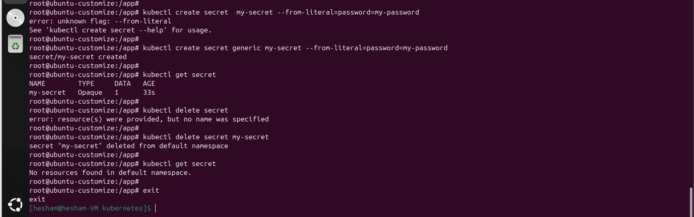

---

## Results Summary

| Resource | Create | Delete |
|----------|:------:|:------:|
| Pods | ✅ Allowed | ❌ `Forbidden` |
| Deployments | ✅ Allowed | ❌ `Forbidden` |
| Secrets | ✅ Allowed | ✅ Allowed |

The `Forbidden` responses confirm that RBAC enforces the **principle of least privilege**: the ServiceAccount can only perform the exact actions defined in its Role.

---

## Cleanup

```bash
kubectl delete -f pod-ubuntu-customize.yml
kubectl delete -f role_RBinding.yml
kubectl delete -f sa.yaml
```

---

## Key Takeaways

- A single custom image can double as a portable in-cluster administration toolbox.
- Pods should run under a **dedicated ServiceAccount** instead of the `default` one.
- `Role` + `RoleBinding` give namespace-scoped, least-privilege access control.
- `Forbidden` errors are a quick, reliable way to validate RBAC rules.

---

## Author

**Hesham Elshereef** — Docker Hub: [`heshamelshereef26`](https://hub.docker.com/u/heshamelshereef26)
